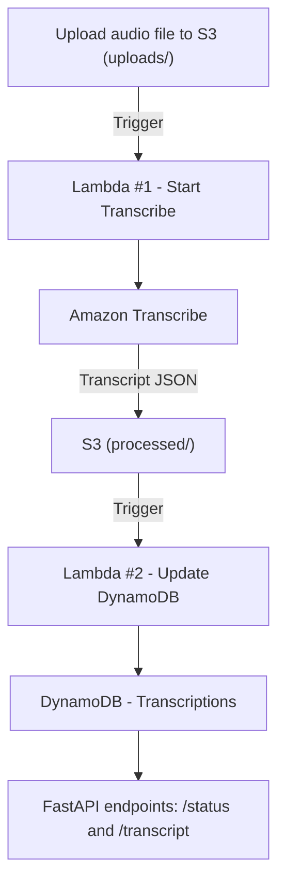

# 🎙️ Audio Transcription Pipeline


## 🚀 Overview

The Audio Transcription Pipeline is a serverless application that automatically converts audio and video files into text using AWS cloud services. It provides an end-to-end workflow where uploaded media files are processed through Amazon Transcribe, results are stored in S3 and DynamoDB, and a FastAPI backend exposes REST endpoints for querying transcription status and retrieving transcripts.

This project demonstrates best practices in cloud-native development, serverless architecture, and Infrastructure-as-Code (IaC) with AWS SAM, making it a scalable and production-ready solution for real-world transcription needs in education, research, or enterprise applications.

---


## 🔁 Flow

1. **User uploads audio file** → stored in **S3** (`uploads/`)
2. **Lambda #1** triggers → starts an **Amazon Transcribe** job and records status in **DynamoDB**
3. When Transcribe finishes → transcript JSON is written to **S3** (`processed/`)
4. **Lambda #2** triggers → updates **DynamoDB** status (`completed`) with transcript location
5. **FastAPI** service provides endpoints:
   - `/status/{file_id}` → check job status
   - `/transcript/{file_id}` → fetch transcript text

---

## 🛠️ Tech Stack

- **Python 3.10**
- **AWS Services**: S3, Lambda, DynamoDB, Amazon Transcribe
- **AWS SAM** (Serverless Application Model)
- **FastAPI + Uvicorn**

---

## 🏗️ Architecture


---
## 📂 Project Structure

```text
audio-transcription-pipeline/
│── backend/              # Lambda + FastAPI code
│   ├── lambda_handler.py         # Lambda #1 (start Transcribe)
│   ├── update_lambda.py          # Lambda #2 (update DynamoDB)
│   ├── app.py                    # FastAPI service
│   ├── requirements.txt
│
│── infra/                # Infrastructure as Code
│   ├── template.yaml              # SAM template
│
│── README.md
```
